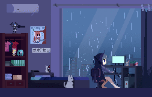

### Olá, eu sou a Kamila Pantoja. 👋😄
#
Profissional com 2 anos de experiência profissional com foco em Desenvolvimento Backend. Sou formada em Processos Gerenciais, e estou cursando minha segunda graduação em Engenharia de Software. Também concluí o curso de Desenvolvimento Web Fullstack da Trybe, onde adquiri conhecimento teórico e prático em Fundamentos de Desenvolvimento de Software, FrontEnd, BackEnd e Ciência da Computação.

Já trabalhei com Marketing Digital com foco em gestão de Tráfego Pago e Mídias Sociais. Em 2021 decidi seguir uma paixão antiga chamada tecnologia, então resolvi fazer minha transição de carreira para a área de Desenvolvimento de Software.

Tenho conhecimento e projetos realizados em: JavaScript, Typescript, Nest.js, Node.js, Express, Banco de Dados, SQL, Docker, Git, Github.
Atualmente tem se dedicado aos estudos voltados ao Desenvolvimento Front-End com React.

## Curiosidades e Hobbies

* Sou atleta de Muay Thai, grau azul clara.
* Entrei no mundo da arte marcial através do Karate Shotokan, pratiquei durante um bom tempo e também fui campeã da minha categoria na 18º Copa Norte de Karatê Interestilos, nas modalidades Kata e Kumite.🥋
* Já fui jogadora de Rugby.🏉
* Gosto de muito de ler livros sobre desenvolvimento pessoal, finanças, tecnologia, espiritualidade e alguns sobre ficção.📚
* Gosto de jogar uns joguinhos no celular e no console.🎮
* Adoro brincar com meus doguinhos.🐕

	

<h2>Habilidades</h2>

    
    
    
    
    
    
    
    
    
    
    
    
    

## Contato

  
  
  
##
  

  <a href="https://github.com/kamilapantoja">
  
  

